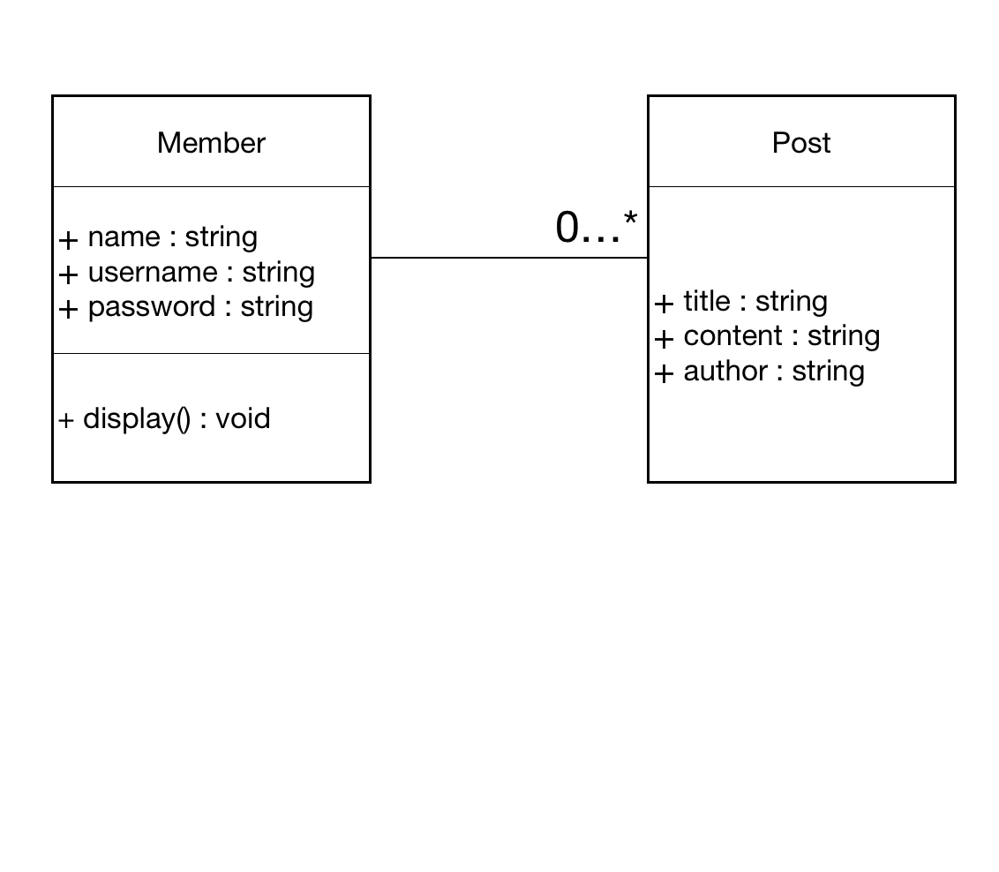

## 01. 프로젝트 개요
- 프로젝트명 : 클래스 사용해보기
- 프로젝트 소개
    - 간단한 소셜 미디어 플랫폼의 회원과 게시물을 관리하는 프로그램 개발
 
## 02. 팀
- 팀명 : 얼레벌레조
- 팀원 : 박연재, 이영훈, 김상아, 임만열, 이예지
- 팀 노션 : https://www.notion.so/teamsparta/ab4beb1070ad4acaab8c4d905b03e4e8

## 03. 프로젝트 내용
- 개발기간 : 2024.07.03 ~ 07.05
- 역할분담  
  |이름|역할|
  |:---|:----|
  |박연재|문서작성, Pull request merge|
  |이영훈|터미널에서 입력받아 Member 인스턴스 만들기 개발, 비밀번호 해시화 후 저장|
  |김상아|Member 클래스 코드작성, 회원 인스턴스 만들기|
  |임만열|post 인스턴스 만들기, 특정 유저나 특정 단어에 대한 게시물 출력|
  |이예지|Post 클래스 코드작성|

  
 요구사항 

  

    

      
&emsp; 1. Member 클래스 정의하기
 
      
&emsp; &emsp;a. 회원이름(name), 회원 아이디(username), 회원 비밀번호(password) 속성 포함

      
&emsp; &emsp;b. 회원 정보를 print 해주는 display 메소드 포함

      
&emsp;&emsp; &emsp;i. 회원의 이름과 아이디만 보여주소 비밀번호는 보여주면 안 됨

    

     
    

      
&emsp; 2. Post 클래스 정의하기 

      
&emsp; &emsp;a. 게시물 제목(title), 게시물 내용(content), 작성자(author) 속성 포함 

      
 &emsp;&emsp;&emsp; i. 작성자(author)는 화원 아이디(username)가 저장되어야 함

    

    

      
&emsp; 3. 회원 인스턴스를 세 개 이상 만들기

      
&emsp;&emsp; a. members라는 빈 리스트에 append를 써서 저장

      
&emsp;&emsp; b. members 리스트를 돌면서 회원들의 이름을 모두 프린트

    

    

      
&emsp; 4. 각각의 회원이 게시글을 3개 이살 작성하는 코드를 만들기

      
&emsp;&emsp; a. 만들어진 게시글의 인스턴스는 posts라는 빈 리스트에 append를 써서 저장

      
&emsp;&emsp; b. for 문을 돌면서 유저가 장겅한 게시글의 제목을 모두 프린트

      
&emsp;&emsp; c. for 문을 돌면서 '특정단어'가 content애 포함된 게시글의 제목을 모두 프린트

    

     
    

      
 추가 요구사항 

      

          
 &emsp; 1. input을 이용하여 Member 인스턴스 만드는 것을 사용자가 터미널에서 할 수 있개 해주세요

          
 &emsp; 2. post도 터미널에서 생성할 수 있게 해주세요

          
 &emsp; 3. hashlib 라이브러리를 써서 회원 비밀번호를 해시화하여 저장하게 해주세요

      

    

  

## 04. 기타
 - 환경 : python 3.9.6

 

  
 기능상세 

  

    
  

 

